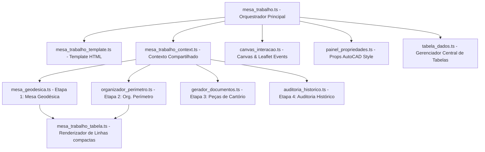

# Relatório Técnico: Arquitetura Modular da Mesa de Trabalho
**GerenciGeo — Georreferenciamento Avançado v2.4**

Este documento detalha a estrutura de código, responsabilidades, fluxos de dados e interdependências de cada arquivo que compõe a **Mesa de Trabalho** (workspace GNSS/CAD), dividida em subtelas e painéis modulares para garantir escalabilidade, legibilidade e fácil manutenção.

---

## 🏛️ Visão Geral da Arquitetura (Mesa de Trabalho)

A Mesa de Trabalho é o núcleo operacional do sistema, integrando o mapa geográfico bidimensional elipsoidal (Leaflet), o visualizador de propriedades AutoCAD-style, as mesas de triagem, ordenação perimetral, laudos de fronteira e logs de auditoria. Para evitar arquivos gigantescos e acoplamento rígido, a interface foi dividida usando o padrão **MVC híbrido direcionado a eventos**, no qual um **Contexto Compartilhado** unifica as referências de estado.



---

## 📂 Mapeamento e Análise Detalhada dos Arquivos

### 1. `mesa_trabalho_context.ts`
*   **Localização**: [mesa_trabalho_context.ts](file:///d:/OneDrive_Thiago/OneDrive/Desenvolvimento/GerenciGeo/frontend/src/views/mesa_trabalho/mesa_trabalho_context.ts)
*   **Propósito**: Define a interface TypeScript `MesaTrabalhoContext` e cria o esqueleto de estado compartilhado.
*   **Responsabilidades**:
    *   Declarar propriedades reativas globais do levantamento e da matrícula (`currentLevId`, `currentMatriculaId`, `pontosList`, `segmentosList`, `matriculasList`, `etapaAtiva`).
    *   Definir assinaturas de métodos de comunicação inter-painéis (`atualizarDestaqueLinhasTabela()`, `alternarEtapa()`, `selectPontoFromTabela()`, `carregarSugestoesNumeracao()`).
    *   Padronizar o contrato de tipagem TypeScript para evitar erros de ponteiro nulo ou propriedades inexistentes entre arquivos distintos.
*   **Design Rationale**: Atua como o contrato de interfaces (a "Constituição de Dados" do frontend), garantindo que qualquer subpainel possa invocar ações em outro de forma desacoplada.

### 2. `mesa_trabalho.ts` (Orquestrador Global)
*   **Localização**: [mesa_trabalho.ts](file:///d:/OneDrive_Thiago/OneDrive/Desenvolvimento/GerenciGeo/frontend/src/views/mesa_trabalho.ts)
*   **Propósito**: Controlar o ciclo de vida da Mesa de Trabalho, gerenciar a alternância de etapas (Ribbon) e instanciar os demais painéis.
*   **Responsabilidades**:
    *   Carregar os metadados do levantamento e das matrículas via chamadas HTTP REST.
    *   Inicializar o mapa Leaflet global (`#mapa-triagem`) e delegar seu controle à classe orquestradora `MesaTrabalhoMapa`.
    *   Configurar a barra de ferramentas superior (**Ribbon**) e os redimensionadores (**Splitters**):
        *   *Splitter Vertical (Props)*: Redimensiona o painel de propriedades AutoCAD.
        *   *Splitter Horizontal (Mapa/Tabela)*: Redimensiona a proporção vertical do mapa e das tabelas inferiores (persistindo as preferências do usuário no `localStorage` via `--table-area-h`).
    *   Implementar a máquina de estado das etapas através de `ctx.alternarEtapa(etapa)`.
*   **Design Rationale**: É o ponto de entrada da view. Ele garante que as regras estéticas e funcionais sejam acionadas na ordem correta durante a montagem da tela.

### 3. `mesa_trabalho_template.ts`
*   **Localização**: [mesa_trabalho_template.ts](file:///d:/OneDrive_Thiago/OneDrive/Desenvolvimento/GerenciGeo/frontend/src/views/mesa_trabalho_template.ts)
*   **Propósito**: Declarar a estrutura visual estática de toda a Mesa de Trabalho por meio de Template Literals em HTML.
*   **Responsabilidades**:
    *   Montar a Ribbon (camada superior de ferramentas divididas por etapa).
    *   Definir o painel lateral de propriedades e sua alça de redimensionamento (`#props-panel-resizer`).
    *   Estruturar o mapa global e seu banner reativo de numeração sugerida do INCRA.
    *   Estabelecer os contêineres e esqueletos das 4 etapas (`view-mesa-geodesica`, `view-org-perimetro`, `view-cartorio`, `view-auditoria`).
*   **Design Rationale**: Separação completa da marcação HTML e da estilização da lógica de negócios TypeScript, mantendo o código modular e focado.

### 4. `mesa_geodesica.ts` (Subtela da Etapa 1)
*   **Localização**: [mesa_geodesica.ts](file:///d:/OneDrive_Thiago/OneDrive/Desenvolvimento/GerenciGeo/frontend/src/views/mesa_trabalho/mesa_geodesica.ts)
*   **Propósito**: Orquestrar a **Mesa Geodésica** (Etapa 1), focada no processamento bruto de dados e auditoria de translação.
*   **Responsabilidades**:
    *   Renderizar as tabelas de vértices geodésicos em tempo real com suporte a ordenação dinâmica de colunas (Ordem, Vértice, Tipo, Coordenadas, Deltas, Status e Origem).
    *   Gerenciar os filtros de exibição de pontos por chips (Bases, Rovers, Brutos e Corrigidos).
    *   Controlar a comutação visual entre sistemas de coordenadas (UTM compatível com AutoCAD ou coordenadas Geodésicas elipsoidais/angulares).
    *   Habilitar filtros rápidos como "Ocultar Fora da Poligonal" e controle do "Modo de Reordenar manual".
    *   Controlar o botão de "Importar CSV" e gatilho de translação geodésica.
*   **Design Rationale**: Centraliza as manipulações matemáticas e de amostragem física de dados brutos e corrigidos antes da montagem perimetral.

### 5. `mesa_trabalho_tabela.ts` (Renderizador de Linhas)
*   **Localização**: [mesa_trabalho_tabela.ts](file:///d:/OneDrive_Thiago/OneDrive/Desenvolvimento/GerenciGeo/frontend/src/views/mesa_trabalho/mesa_trabalho_tabela.ts)
*   **Propósito**: Fornecer um motor otimizado de renderização HTML de linhas de tabela para vértices e pontos.
*   **Responsabilidades**:
    *   Implementar `renderLinhaPontoCartorioHtml(p, ordem, selecionado)` para a tabela compacta da Etapa 2.
    *   Implementar `renderLinhaPontoGeoprocessamentoHtml(p, selecionado)` para a tabela detalhada da Etapa 1.
    *   Formatar dinamicamente as coordenadas com casas decimais fixas (metros para UTM, e graus decimais ou sexagesimais para geodésicas).
    *   Zerar espaçamentos verticais de padding (`py-0`) e otimizar fontes e badges para garantir a altura fixa de `23px` por linha (visibilidade máxima sem rolagens excessivas).
    *   Pintar linhas selecionadas com destaque translúcido de seleção de forma sincronizada com o mapa.

### 6. `organizador_perimetro.ts` (Subtela da Etapa 2)
*   **Localização**: [organizador_perimetro.ts](file:///d:/OneDrive_Thiago/OneDrive/Desenvolvimento/GerenciGeo/frontend/src/views/mesa_trabalho/organizador_perimetro.ts)
*   **Propósito**: Gerenciar o **Organizador de Perímetro** (Etapa 2), focado na modelagem topológica da matrícula e das divisas de confrontantes.
*   **Responsabilidades**:
    *   Renderizar e controlar a ordenação do caminhamento da matrícula ligando $P_n \to P_{n+1}$ sequencialmente até o fechamento.
    *   Gerenciar o "Modo Caminhar por Clique", que permite ao usuário reconstruir a poligonal simplesmente clicando nos pontos em sequência diretamente no mapa.
    *   Renderizar a Tabela de Confrontantes e Divisas, exibindo cálculos elipsoidais de azimute, distância real, estado de anuência do vizinho e peças técnicas atreladas.
    *   Integrar o cadastro rápido de novos confrontantes de divisa.
    *   Controlar o salvamento determinístico de ordem perimetral (que purga e reconstrói as divisas no banco de dados SQLite).
*   **Design Rationale**: Aplica a regra de **Autorregeneração de Divisas** estabelecida no Protocolo V.L.A.E.G. sempre que o usuário altera a topologia da matrícula.

### 7. `painel_propriedades.ts`
*   **Localização**: [painel_propriedades.ts](file:///d:/OneDrive_Thiago/OneDrive/Desenvolvimento/GerenciGeo/frontend/src/views/mesa_trabalho/painel_propriedades.ts)
*   **Propósito**: Gerenciar o painel lateral de metadados e propriedades (inspirado na barra de propriedades do AutoCAD).
*   **Responsabilidades**:
    *   Renderizar os metadados gerais da matrícula ativa (Matrícula, Área em hectares, Perímetro, Comarca, Fuso UTM, Proprietários e Confrontantes).
    *   Exibir propriedades geométricas determinísticas de pontos selecionados (Nome, Tipo de Ponto, Coordenadas UTM E/N, Latitude/Longitude angulares, Altitude elipsoidal, Sigmas em milímetros e arquivo de origem).
    *   Permitir a edição direta de metadados (como alterar o tipo de ponto, nome do vértice ou alterar coordenadas manualmente) com salvamento no banco de dados via API REST.
*   **Design Rationale**: Centraliza os formulários de entrada e exibição de detalhes, evitando poluir a tela principal com modais e inputs esporádicos.

### 8. `canvas_interacao.ts`
*   **Localização**: [canvas_interacao.ts](file:///d:/OneDrive_Thiago/OneDrive/Desenvolvimento/GerenciGeo/frontend/src/views/mesa_trabalho/canvas_interacao.ts)
*   **Propósito**: Gerenciar os cliques espaciais do usuário e a sincronização visual entre o mapa geográfico e as tabelas de dados.
*   **Responsabilidades**:
    *   Interceptar cliques em elementos do mapa Leaflet e tabelas físicas.
    *   Evitar conflitos de clique que façam modais ou painéis laterais de propriedades fecharem quando o usuário está manipulando vértices.
    *   Garantir que a seleção de múltiplos vértices no mapa destaque simultaneamente as linhas corretas nas tabelas inferiores, e vice-versa.
*   **Design Rationale**: Centraliza as regras de UX espacial e micro-interações do mapa, atuando como o tradutor de eventos geométricos para eventos lógicos.

### 9. `tabela_dados.ts`
*   **Localização**: [tabela_dados.ts](file:///d:/OneDrive_Thiago/OneDrive/Desenvolvimento/GerenciGeo/frontend/src/views/mesa_trabalho/tabela_dados.ts)
*   **Propósito**: Auxiliar a amarração dos dados reativos da tabela com os eventos DOM locais (como escutar cliques de subir/descer e checar caixas de ignorar ponto).
*   **Responsabilidades**:
    *   Vincular os listeners para cliques em botões específicos dentro da tabela (`btn-subir-ponto`, `btn-descer-ponto`, `chk-ignorar-poligono`).
    *   Tratar o scroll automático da tabela para focar a linha correspondente quando o usuário clica em um vértice no mapa.

### 10. `gerador_documentos.ts` (Subtela da Etapa 3)
*   **Localização**: [gerador_documentos.ts](file:///d:/OneDrive_Thiago/OneDrive/Desenvolvimento/GerenciGeo/frontend/src/views/mesa_trabalho/gerador_documentos.ts)
*   **Propósito**: Orquestrar a Etapa 3 (Peças de Cartório), focada no preenchimento de metadados e impressão/geração dos documentos legais.
*   **Responsabilidades**:
    *   Renderizar as telas de preenchimento de dados profissionais (CREA/CFTA, TRT, endereço) e dados da propriedade para injeção nos templates.
    *   Garantir a geração determinística do Laudo de Faixa de Fronteira (Calculando a distância geodésica determinística elipsoidal módulo 8 via classe `pyproj.Geod` do servidor).
    *   Gerar o Requerimento de Ratificação do CRI em HTML nativo estilizado, pronto para impressão/conversão via `window.print()`.

### 11. `auditoria_historico.ts` (Subtela da Etapa 4)
*   **Localização**: [auditoria_historico.ts](file:///d:/OneDrive_Thiago/OneDrive/Desenvolvimento/GerenciGeo/frontend/src/views/mesa_trabalho/auditoria_historico.ts)
*   **Propósito**: Controlar a Etapa 4 (Histórico de Auditoria).
*   **Responsabilidades**:
    *   Renderizar o histórico comparativo cronológico de alterações do banco de dados (tabelas e metadados editados) com autoria e data.

---

## 📈 Fluxo de Dados e Ciclo de Redimensionamento

Abaixo, descrevemos o ciclo de vida e o fluxo de dados ativado quando o usuário redimensiona a interface verticalmente por meio do splitter horizontal:

```
[ Usuário arrasta o #splitter-mapa-tabela ]
                  │
                  ▼
[ Evento MouseMove interceptado no mesa_trabalho.ts ]
                  │
                  ▼
[ Calcula a nova altura Y baseado no limite mínimo (150px) ]
                  │
                  ▼
[ Executa style.setProperty('--table-area-h', `${newHeight}px`) no mainContent ]
                  │
                  ▼
[ O navegador reajusta o layout: ]
├── view-panel ativa encolhe/cresce para o novo valor de --table-area-h
└── mapa-container-wrapper (flex: 1) se expande ou contrai no espaço restante
                  │
                  ▼
[ Invocado triagemMap.invalidateSize() para recalcular projeções do Leaflet ]
                  │
                  ▼
[ Salva o valor final no localStorage('gerencigeo_table_height') ]
```

---

## 📋 Resumo das Persistências Locais (LocalStorage)

Para manter a interface consistente e confortável para o profissional, a Mesa de Trabalho grava dinamicamente as seguintes chaves de estado de layout:

| Chave | Descrição | Valor Padrão | Utilizado por |
| :--- | :--- | :--- | :--- |
| `gerencigeo_table_height` | Altura vertical reservada para os painéis de tabelas inferiores. | `280px` | `#splitter-mapa-tabela` |
| `gerencigeo_props_panel_width` | Largura horizontal do painel de propriedades lateral. | `280px` | `#props-panel-resizer` |
| `gerencigeo_split_sup_width` | Largura da coluna da esquerda do splitter superior (Triagem/Ingestão/Ordenador). | `250px` - `350px` | `#splitter-superior` |
| `gerencigeo_split_inf_width` | Largura horizontal dedicada à tabela lateral de divisas/confrontantes. | Dinâmico | `#splitter-inferior` |

---
